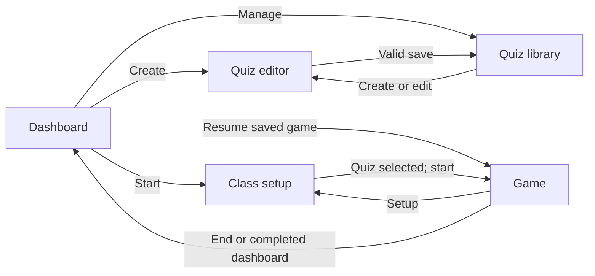
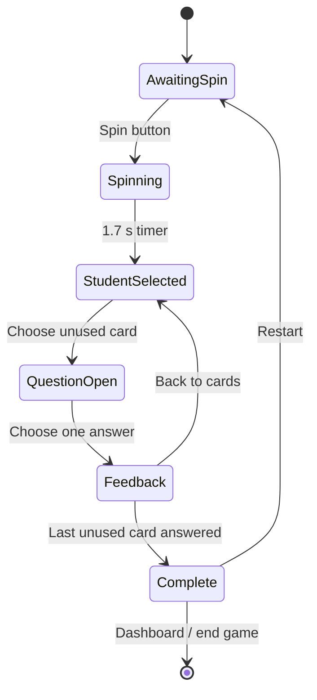

# Game Flow

This document summarizes the current transitions in `src/App.tsx`; the source remains authoritative.

## Application views

`App` owns a `View` value with five states: `dashboard`, `quizzes`, `editor`, `setup`, and `game`. These are conditional React views, not URL routes.

On startup, the presence of any parsed saved game selects the `game` view. The game renders only when both the saved `GameState` and its referenced quiz exist; otherwise it shows “No active game” with a setup action.

## Classroom round

- **Spin:** a student number is chosen uniformly with `Math.floor(Math.random() * studentCount) + 1`. The wheel animation is temporary; after 1.7 seconds the selected student is persisted.
- **Card selection:** cards whose IDs are in `completedQuestionIds` are disabled. Opening an unused card stores the question and a shuffled list of its original option indexes only in component state.
- **Answer:** the first answer click sets temporary feedback state and immediately appends the question ID to persisted completion state. Correctness is checked against the original option index, not its displayed position.
- **Feedback:** correct and incorrect states include text and an explanation. Correct answers trigger a chime and speech; incorrect answers trigger speech. Answering the final card schedules the celebration sound and displays completion controls.
- **Next round:** closing feedback clears the active question and selected answer. The current student remains until another spin.
- **Restart:** resets `currentStudent` and `completedQuestionIds` while retaining the selected quiz and student count.
- **End:** clears only active-game storage and returns to the dashboard.

Student numbers may repeat between spins; the implementation prevents reused questions, not repeated students.

## Persistent and temporary state

Persisted `GameState`: quiz ID, student count, current student, and completed question IDs.

Temporary `GameLobby` state: spinning flag, wheel rotation, active question, shuffled option order, and selected answer. Refreshing during a spin, open question, or feedback discards that presentation state and restores the saved game board. An answer is considered complete as soon as it is submitted, even if refresh occurs before the feedback modal is closed.

See `STORAGE.md` for validation and recovery limitations.
