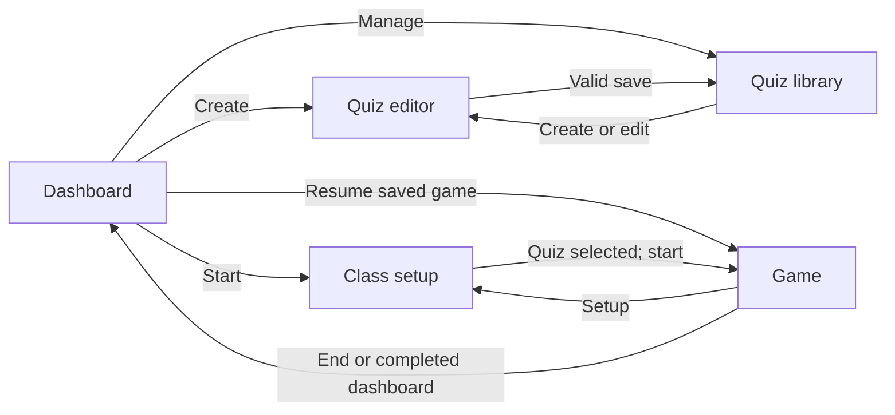
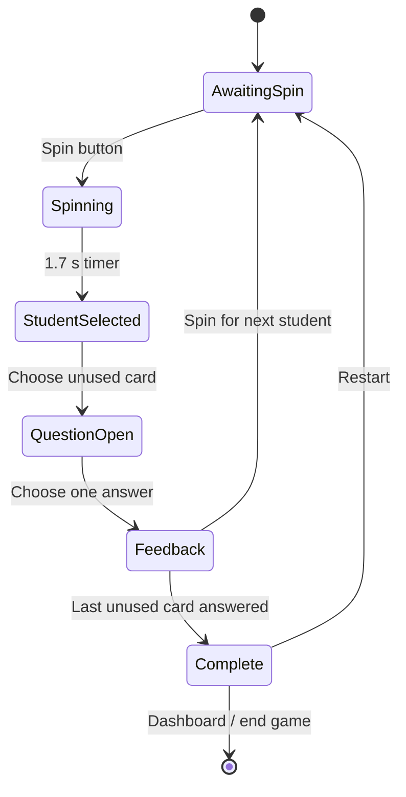

# Game Flow

This document summarizes the current transitions in `src/App.tsx`; the source remains authoritative.

## Application views

`App` owns a `View` value with five states: `dashboard`, `quizzes`, `editor`, `setup`, and `game`. These are conditional React views, not URL routes.

On startup, the presence of any parsed saved game selects the `game` view. The game renders only when both the saved `GameState` and its referenced quiz exist; otherwise it shows “No active game” with a setup action.

## Classroom round

- **Spin:** one currently eligible student is chosen uniformly. Each wheel entry can have a custom name, color, and icon. The selected student and updated win count are persisted after the animation.
- **Winner policy:** teachers can keep every student eligible indefinitely, remove a student after one win, or set a per-student win limit. Resetting the wheel clears win counts without resetting question progress.
- **Card selection:** the question board stays visibly inactive until the wheel selects a student. The selected student must choose one unused card before another spin is allowed. Completed cards remain disabled. Opening a card stores the question, selected student snapshot, and shuffled list of original option indexes only in component state.
- **Answer:** the first answer click sets temporary feedback state, appends the question ID to persisted completion state, and clears the persisted current student so the next round must begin with a spin. Correctness is checked against the original option index, not its displayed position.
- **Feedback:** correct and incorrect states include text and an explanation. Correct answers trigger a chime and speech; incorrect answers trigger speech. Answering the final card schedules the celebration sound and displays completion controls.
- **Next round:** the feedback dialog’s primary action is “Spin for the next student.” Closing feedback clears the temporary question, student snapshot, and selected answer, then returns focus to Spin.
- **Restart:** resets the current student, win counts, and completed question IDs while retaining the selected quiz and wheel setup.
- **End:** clears only active-game storage and returns to the dashboard.

Student repeats follow the configured winner policy. Completed questions remain unavailable independently of the wheel policy.

## Persistent and temporary state

Persisted `GameState`: quiz ID, customized students, winner policy, current student, per-student win counts, and completed question IDs.

Temporary `GameLobby` state: spinning flag, wheel rotation, active question, active student snapshot, shuffled option order, and selected answer. Refreshing during a spin, open question, or feedback discards that presentation state and restores the saved game board. An answer is considered complete and the next round awaits a spin as soon as it is submitted, even if refresh occurs before the feedback modal is closed.

See `STORAGE.md` for validation and recovery limitations.
